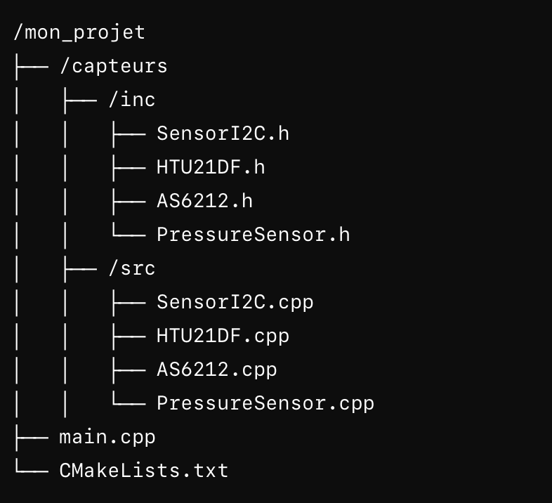
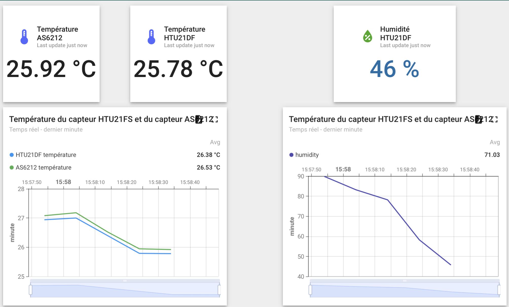

# Projet : Mesure de température et humidité via LoRaWAN sur carte Zest Core FMLR-72 avec le module Zest_Sensor_P-T-RH

Ce projet implémente un système embarqué pour mesurer la température et l'humidité à l'aide des capteurs **HTU21DF** et **AS6212**. Les données sont transmises via LoRaWAN par la carte **CATIE 6tron Zest Core FMLR-72**.

---

## Objectifs

- Mesurer la **température** et l'**humidité** avec des capteurs I2C.  
- Transmettre les données via LoRaWAN sur la plateforme ThingsBoard avec des étiquettes.  

---

## Matériel Requis

1. **Carte Zest Core FMLR-72**  
2. **Zest_Sensor_P-T-RH** 
3. **Environnement mbed**

---

## Fonctionnalités

1. **Lecture des capteurs**  
   - Récupération des données environnementales via I2C.  
   - Conversion en valeurs exploitables pour la transmission.

2. **Transmission LoRaWAN**  
   - Envoi des mesures sous forme de payload JSON.  
   - Gestion de la connexion et des événements via `LoRaWANInterface`.

3. **Optimisation de la consommation**  
   - Mise en veille de la carte entre deux relevés.  
   - Utilisation d'interruptions pour réveiller la carte lors d'événements critiques.

4. **Debug**  
   - Messages en temps réel affichés sur un terminal série.  

## Payload Transmis

Les données envoyées au réseau LoRaWAN suivent ce format :  
```json
{
    "temperature": 22.5,
    "humidity": 40.2,
    "as6212_temperature": 22.3
}
```
---
## Récupération, Installation et Exécution du Programme

Suivez ces étapes pour récupérer et installer le programme sur votre environnement de travail. Assurez-vous de bien suivre chaque étape dans le terminal. ( si vous avez besoin de plus d'explication ou rencontrer des problèmes, allez voire le cours numéro 1 du projet)

### Prérequis
Avant de commencer, vous devez avoir les éléments suivants installés :
- **Git** : Pour cloner le repository.
- **Mbed CLI** : Pour gérer le projet Mbed et compiler le code.
- **GCC_ARM Toolchain** : Utilisé pour compiler le programme.
- **Carte Sixtron6** et **ZEST_CORE_FMLR-72** : Matériel nécessaire pour le projet.

### Étape 1 : Cloner le repository depuis GitHub
Commencez par cloner le dépôt Git contenant le projet en utilisant la commande suivante dans votre terminal :

``` bash
   git clone https://github.com/LucasBouchic/PROJET_MBED.git
```
Cela téléchargera tous les fichiers nécessaires pour le projet dans un répertoire local sur votre machine.

### Étape 2 : Installer les librairies nécessaires

Ensuite, naviguez dans le répertoire du projet cloné et utilisez la commande mbed os pour installer toutes les librairies et dépendances nécessaires au projet :

```bash
cd PROJET_MBED
mbed os
```
Cela téléchargera et installera automatiquement toutes les librairies requises pour le bon fonctionnement du projet.

### Étape 3 : Configurer la cible Mbed

Vous devez spécifier la cible matérielle sur laquelle vous allez exécuter le programme. Dans ce cas, la cible est ZEST_CORE_CORE_FMLR-72. Utilisez la commande suivante :

```bash
mbed target ZEST_CORE_CORE_FMLR-72
```
### Étape 4 : Configurer le toolchain
Assurez-vous que le compilateur GCC_ARM est sélectionné en tant que toolchain pour la compilation. Exécutez la commande suivante :
```bash
mbed toolchain GCC_ARM
```
Cela configure Mbed CLI pour utiliser la toolchain GCC_ARM pour la compilation du projet.

### Étape 5 : Configurer le projet
Avant de compiler le projet, vous devez configurer certains paramètres de votre projet en exécutant la commande suivante dans le répertoire racine du projet :

```bash
mbed config root .
```

Cette commande configure les paramètres du projet et prépare votre environnement de travail.

### Étape 6 : Compiler le projet
Maintenant, vous pouvez compiler le projet en utilisant la commande suivante :

```bash
mbed compile
```
Cela va compiler le code source pour générer un fichier binaire qui peut être flashé sur la carte Sixtron6.

### Étape 7 : Flasher la carte Sixtron6
Une fois la compilation terminée, il est temps de flasher le programme sur la carte Sixtron6. Utilisez la commande suivante :
```bash 
sixtron_flash
```
Cela va transférer le fichier binaire généré sur votre carte Sixtron6, et le programme sera exécuté immédiatement après le flashage.

---

## Architecture du Projet

Afin de rendre le projet lisible, nous avons décidé de faire une architecture comme ci-dessous (dans notre project, il n'y pas le capteur de pression car sur notre carte, le capteur semblait défectueux).

### Exemple d'architecture 

<p align="center">
    
</p>
<p align="center">
    <em>Figure : Architecture du Projet.</em>
</p>

Nous avons créé dans notre projet un dossier `capteurs` qui comporte un `src` et un `inc` qui contiennet les `.h` et les `.cpp` des différents capteurs ainsi que le `.h` de notre protocole de communication avec nos capteurs (I2C). 

### Les modifications nécessaire dans le project 

Dans un premier temps, il faut inclure correctement les `.h`, il faut bien indiquer où se trouvent les différents fichiers : 


```cpp

#include "capteurs/inc/HTU21DF.h"
#include "capteurs/inc/AS6212.h"
#include "capteurs/inc/PressureSensor.h"

```
Ensuite, les différents `.cpp` ne sont plus situés à la racine du projet, ils sont dans un dossier du projet. Le CmakeLists, lui, est à la racine et compile le projet à la racine. Il est donc necessaire de lui indiquer d'aller compiler tout les `.cpp` des différents capteurs dans notre dossier `capteurs`. Nous devons modifier la partie `targer_SOURCE` du CmakeLists : 

```txt
target_sources(${APP_TARGET}
    PRIVATE
        main.cpp
        capteurs/src/HTU21DF.cpp
        capteurs/src/AS6212.cpp
)
```

---

## Rôle important de `snprintf` et choix de `tx_buffer`

Nous avons décidé de ne pas utiliser la variable payload pour transmettre les données, car elle est définie comme une chaîne statique fixe.
Nous avons préféré choisir d'utiliser `snprintf` pour remplir dynamiquement le tableau `tx_buffer` avec les données mesurées par les capteurs, car cette approche permet de :

- **Gérer dynamiquement les données** : `snprintf` formate une chaîne de caractères en insérant les valeurs mesurées directement dans le tableau `tx_buffer`.
- **Optimisation de la mémoire** : Plutôt que d'utiliser une variable intermédiaire (`payload`), `snprintf` écrit directement dans le buffer de transmission (`tx_buffer`), évitant ainsi la duplication inutile des données.
- **Prévention des débordements** : `snprintf` limite automatiquement la taille de la chaîne formatée pour s'assurer qu'elle ne dépasse pas la taille allouée au tableau `tx_buffer`. Cela réduit le risque de débordement de mémoire, qui peut entraîner des comportements imprévisibles.

--- 

## Thingsboard

### Présentation 

**ThingsBoard** est une plateforme IoT open-source permettant de collecter, traiter, visualiser et gérer des données provenant de divers dispositifs connectés. 

Elle offre des outils pour :

- **Visualisation des données** : Créez des tableaux de bord interactifs pour afficher les données en temps réel ou historiques sous forme de graphiques, jauges ou tableaux.
- **Gestion des dispositifs** : Suivez et configurez vos appareils IoT à distance.
- **Automatisation** : Configurez des alertes, des règles et des actions automatiques en fonction des données reçues.

Dans ce projet, ThingsBoard est utilisé pour :

- Collecter les données des capteurs (température et humidité) transmises via LoRaWAN.
- Visualiser ces données sur une interface utilisateur.
  
voici le lien pour accéder à la page d'accueil : 
```txt
https://thingsboard.cloud/home
```

### Notre tableau de bord (Groupe 7)



<div align="center">
    <em>Figure : Capture d'écran de notre Thingboard en fonctionnement.</em>
</div>
</p>
<p align="justify">
Le tableau de bord se découpe en deux parties (gauche => température et droite => humidité). Nous pouvons voir dans un premier temps deux widgets de température en haut à gauche. Ces deux températures correspondent au retour de température du capteur AS6212 et HTU21DF. En dessous de ces deux widgets, nous avons un graphique en temps réel des deux températeurs mesurées par les capteurs, cela permet de visualiser sur un pédiode de temps donnée, l'évolution des températures au cours du temps. 
</p>
<p align="justify">
Sur la droite du tableau de bord, nous avons un widget qui correspond à l'humidité mesurée par le capteur. Nous avons fait en sorte que plus l'humidité est importante, plus la couleur de l'écriture devient forcée ( 0% d'humidité => bleu ciel, 100% d'humidité => bleu forcé). En dessous du widget, nous avons un graphique en temps réel de l'humidité mesurée par le capteur, cela permet de visualiser sur un pédiode de temps donnée l'évolution de l'humidité au cours du temps. 
</p>

---

# EXERCICE 1 : Contrôle d'une LED avec un compteur basé sur une interruption

Cet exercice configure une LED pour alterner son état selon un compteur, qui est ajusté via des interruptions déclenchées par un bouton. La LED clignote avec une fréquence variable.

---

## Fonctionnement

1. **Initialisation :**
   - Une LED (`DigitalOut led`) et un bouton (`InterruptIn bt`) sont configurés.
   - Un objet `Ticker` (`led_freq`) gère la fréquence de clignotement.

2. **Clignotement de la LED :**
   - La fonction `flip` est appelée périodiquement par le `Ticker`.
   - Elle gère l'état de la LED en fonction d'un compteur (`compteur`), alternant entre ON et OFF.

3. **Changement de fréquence :**
   - L'interruption déclenche la fonction `change_max_count` pour ajuster la valeur maximale du compteur (`max_compteur`), modifiant ainsi la fréquence de clignotement.

4. **Boucle principale :**
   - Une boucle infinie garde le programme actif avec une temporisation de 1 seconde.

---

# EXERCICE 2 : Comportement simple LED et bouton

Cet exercice utilise un bouton pour contrôler directement l'état d'une LED. La LED s'allume uniquement lorsqu'un appui est détecté.

---

## Fonctionnement

1. **Initialisation :**
   - Une LED (`DigitalOut led`) et un bouton (`DigitalInOut bt`) sont configurés.

2. **Interaction LED/Bouton :**
   - Dans la boucle principale, la LED suit l'état du bouton en temps réel (`led = bt.read()`).

3. **Temporisation :**
   - Un délai fixe (`500 ms`) est utilisé pour limiter les ressources consommées.

---

# EXERCICE 3 : Lecture et affichage des données de capteurs (I2C)

Cet exercice met en œuvre une communication I2C pour lire des données de capteurs tels que température, humidité et pression, et les afficher dans la console.

---

## Fonctionnement

1. **Lecture de la température :**
   - Le capteur HTU21DF fournit une température brute convertie avec la formule :  
     `temp = -46.85 + (175.72 * raw_temp / 65536.0)`.

2. **Lecture de l'humidité :**
   - Le même capteur mesure l'humidité brute, convertie par :  
     `humidity = -6.0 + (125.0 * raw_hum / 65536.0)`.

3. **Lecture de la température (capteur AS6212) :**
   - Une autre température est mesurée avec une précision améliorée via :  
     `temp_AS6212 = raw_temp_AS6212 / 128.0`.

4. **Lecture de la pression :**
   - Un capteur annexe fournit la pression via :  
     `pressure = raw_pressure / 256.0`.

5. **Affichage :**
   - Toutes les valeurs sont affichées dans la console avec un formatage précis.

6. **Boucle principale :**
   - Les lectures sont réalisées toutes les 500 ms, garantissant un flux régulier d'informations.

---

# EXERCICE 4 : Synchronisation de threads avec Mutex et contrôle de LED

Cet exercice illustre l'utilisation des **mutex** pour gérer des threads simultanés et éviter les conflits lors de l'accès aux ressources partagées, comme l'affichage dans la console. Deux threads ("Ping" et "Pong") affichent leurs messages, tandis que le thread principal clignote une LED et affiche "Alive".

---

## Fonctionnement

1. **Initialisation :**
   - Un **Mutex** (`printf_mutex`) est utilisé pour synchroniser l'accès à la console.
   - Deux threads (`ping_thread` et `pong_thread`) sont créés pour exécuter les fonctions `ping` et `pong`.

2. **Gestion des threads :**
   - Les threads `ping` et `pong` exécutent respectivement 100 itérations pour afficher "Ping" et "Pong".
   - Avant chaque affichage, les threads acquièrent le mutex (`printf_mutex.lock()`), garantissant que les messages ne se chevauchent pas.

3. **Thread principal :**
   - Le thread principal clignote une LED et affiche "Alive" toutes les 2 secondes, indiquant que le programme est actif.

4. **Synchronisation via Mutex :**
   - Les threads verrouillent le mutex avant d'accéder à la console et le libèrent après avoir affiché leurs messages.
   - Cela garantit que les messages "Ping", "Pong", et "Alive" sont affichés de manière ordonnée.

---

## Boucle principale

- Le thread principal fonctionne indépendamment des threads `ping` et `pong`.
- La LED principale clignote à un intervalle de 2 secondes, offrant une indication visuelle de l'état du programme.

---
